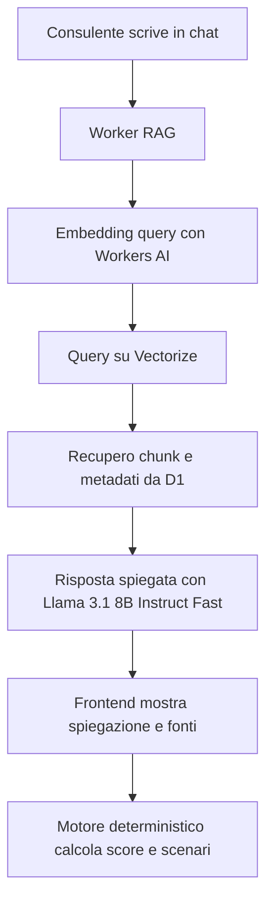

# Cloudflare RAG MVP

## Obiettivo

Costruire un primo layer RAG per il simulatore senza spostare nel modello le logiche che devono restare deterministiche.

La regola guida resta:

- `RAG per capire e spiegare`
- `motore regole per decidere e simulare`

## Scelta tecnica giusta per stare gratis

Per il primo MVP consiglio:

- `Cloudflare Pages` per il frontend gia online
- `Cloudflare Worker` separato per API RAG
- `Workers AI` per embeddings e risposta
- `Vectorize` per ricerca semantica sui documenti
- `D1` per metadati, chunk e benchmark strutturati

Per il momento eviterei `AI Search / AutoRAG`, perche la guida ufficiale richiede una subscription `R2` attiva prima di creare la RAG gestita.

## Modelli consigliati

### Embedding

Modello suggerito:

- `@cf/baai/bge-m3`

Perche:

- multi-lingua
- adatto a retrieval
- costo basso

Alternativa molto buona per contenuti multilingua:

- `@cf/google/embeddinggemma-300m`

### LLM

Modello suggerito:

- `@cf/meta/llama-3.1-8b-instruct-fast`

Perche:

- multilingua
- veloce
- adatto a spiegazioni, chat e tool-like prompting

## Cosa va nel RAG di questo prodotto

Da mettere in `Vectorize`:

- metodologia del simulatore
- spiegazioni commerciali delle coperture
- note sui benchmark
- FAQ consulente
- schede prodotto sintetiche
- note territoriali e benchmark narrativi

Da tenere in `D1` e nel motore:

- prezzi casa per citta
- benchmark figli
- benchmark spese familiari
- mapping professioni e rischi
- formule di score
- scenari e priorita polizze

## Flusso applicativo



## File creati nel repo

- worker: [index.js](/Users/matteo7/Desktop/Simulatore%20scenari%20assicurativi/cloudflare/rag-worker/src/index.js)
- config worker: [wrangler.jsonc](/Users/matteo7/Desktop/Simulatore%20scenari%20assicurativi/cloudflare/rag-worker/wrangler.jsonc)
- schema D1 RAG: [rag-schema.sql](/Users/matteo7/Desktop/Simulatore%20scenari%20assicurativi/cloudflare/d1/rag-schema.sql)
- seed iniziale: [knowledge-seed.json](/Users/matteo7/Desktop/Simulatore%20scenari%20assicurativi/cloudflare/rag-worker/seed/knowledge-seed.json)

## Endpoint pronti

### `GET /health`

Serve per verificare il worker e i modelli configurati.

### `POST /api/rag/ingest`

Accetta:

```json
{
  "documents": [
    {
      "id": "policy-home-liability",
      "title": "Quando ha senso proporre RC Famiglia e Casa",
      "category": "product",
      "sourceType": "internal_product_logic",
      "tags": ["polizza", "casa"],
      "text": "..."
    }
  ]
}
```

Fa:

- chunking del testo
- embedding dei chunk
- salvataggio documento e chunk in `D1`
- upsert dei vettori in `Vectorize`

### `POST /api/rag/query`

Accetta:

```json
{
  "question": "Se il cliente ha gia casa, perche dovrei proporgli una polizza casa?",
  "audience": "advisor",
  "topK": 6
}
```

Restituisce:

- risposta in italiano
- citazioni
- match recuperati
- modelli usati

## Setup operativo

### 1. Crea il database D1

```bash
wrangler d1 create simulatore-rag
```

Poi aggiorna il `database_id` in [wrangler.jsonc](/Users/matteo7/Desktop/Simulatore%20scenari%20assicurativi/cloudflare/rag-worker/wrangler.jsonc).

### 2. Applica lo schema RAG

```bash
wrangler d1 execute simulatore-rag --file cloudflare/d1/rag-schema.sql
```

### 3. Crea l'indice Vectorize

Per creare l'indice devi usare una dimensione coerente con il modello embedding scelto.

La strada pratica piu sicura e:

1. provare una chiamata embedding al modello
2. leggere `shape[1]`
3. creare l'indice con quella dimensione

Esempio:

```bash
wrangler vectorize create simulatore-knowledge --dimensions <DIMENSIONE_MODELLO> --metric cosine
```

### 4. Deploy del worker

```bash
wrangler deploy
```

### 5. Ingest iniziale

Chiama:

```bash
curl -X POST https://<worker-url>/api/rag/ingest \
  -H "Content-Type: application/json" \
  --data @cloudflare/rag-worker/seed/knowledge-seed.json
```

## Roadmap consigliata

### Step 1

Usare il RAG solo per:

- spiegare obiettivi e coperture
- supportare il consulente in chat
- recuperare benchmark descrittivi

### Step 2

Aggiungere fonti esterne e interne:

- FAQ commerciali
- linee guida di colloquio
- schede prodotto interne
- metodologia benchmark

### Step 3

Collegare il frontend:

- chat iniziale -> `normalize intake`
- pagina 3 -> `spiegami perche questa copertura`
- export PDF -> `spiegazione cliente`

## Limiti free da tenere presenti

Cloudflare oggi documenta:

- `Workers AI`: 10.000 neurons al giorno gratis
- `D1`: 5 milioni righe lette al giorno, 100.000 righe scritte al giorno, 5 GB storage sul piano free
- `Pages`: 500 build al mese sul piano free

Su `Vectorize`, la documentazione ufficiale mostra quote sul piano `Workers Free`, ma in una pagina pricing compare ancora una nota che parla di disponibilita sul piano paid. Quindi il codice e pronto, ma conviene verificare subito nel tuo account se l'indice `Vectorize` e attivabile senza upgrade.

## Regola pratica di prodotto

Se il cliente chiede:

- "perche questa polizza?"
- "cosa protegge?"
- "perche questo benchmark e sensato?"

risponde il `RAG`.

Se il sistema deve decidere:

- score
- probabilita
- capitale eroso
- priorita polizze

risponde il `motore deterministico`.
