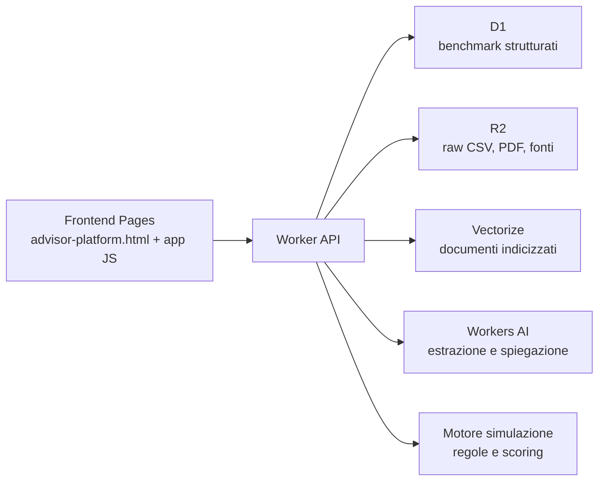

# RAG e Cloudflare per il simulatore

## Cos'e un RAG

RAG significa `Retrieval-Augmented Generation`.

In pratica:

1. l'utente fa una domanda o inserisce note sul cliente;
2. il sistema recupera i dati e i documenti piu rilevanti;
3. il modello genera la risposta usando quel contesto, non solo la sua memoria generale.

Per questo progetto il punto chiave e uno:

- il `motore matematico` resta deterministico e separato;
- il `RAG` serve per capire meglio il caso, recuperare benchmark corretti e spiegare bene il risultato.

## Dove metterei il RAG qui dentro

Non lo metterei nel cuore della simulazione.

Il calcolo di:

- probabilita di raggiungimento obiettivi
- gap patrimoniale
- capitale eroso
- impatto delle coperture
- scoring delle polizze

deve restare nel motore locale o in una API server-side con regole esplicite.

Il RAG lo metterei invece in 4 punti:

1. `Chat iniziale`
   - interpreta gli appunti del consulente
   - normalizza campi mancanti o ambigui
   - suggerisce quali informazioni chiedere

2. `Benchmark contestuali`
   - recupera dati per citta, area geografica, fascia di reddito, fase di vita
   - esempio: costo medio casa a Milano, costo universitario medio, spesa media famiglia con figli

3. `Spiegazione commerciale`
   - traduce i numeri in una narrativa chiara per il cliente
   - esempio: "con 85 euro al mese trasferisci un rischio che oggi ti costringerebbe a tenere fermo molto piu capitale"

4. `Supporto consulente`
   - spiega perche una polizza e suggerita
   - recupera note metodologiche, FAQ, schede prodotto, glossario

## Cosa NON metterei nel RAG

- formule di scoring
- coefficienti di simulazione
- logiche di priorita prodotto
- calcolo del premio
- regole di compatibilita obiettivo/profilo

Queste cose vanno in `database strutturato + motore regole`.

## Architettura consigliata su Cloudflare

### Ruolo dei componenti

`Cloudflare Pages`

- ospita il frontend
- si collega a GitHub per deploy automatici

`Workers`

- espone le API
- riceve la chat
- recupera benchmark e documenti
- richiama il motore di simulazione

`D1`

- salva dati strutturati
- perfetto per tabelle come:
  - prezzi casa per citta
  - canoni medi
  - costo universita
  - spese familiari benchmark
  - profili cliente
  - simulazioni salvate

`R2`

- conserva file grezzi
- CSV ufficiali
- PDF metodologici
- versioni dei dataset

`Vectorize`

- indicizza testi e documenti
- utile per FAQ, schede prodotto, note metodologiche, dataset description, guide consulente

`Workers AI`

- parsing della chat
- classificazione dei bisogni
- spiegazioni e sintesi

## Cosa va in D1 e cosa va in Vectorize

### D1

Dati numerici e interrogabili con filtri netti:

- `city_housing_prices`
- `city_rent_prices`
- `university_costs`
- `household_expense_benchmarks`
- `income_benchmarks`
- `life_stage_benchmarks`
- `policy_catalog`
- `simulation_runs`

### Vectorize

Documenti semantici:

- schede prodotto
- FAQ consulente
- metodologia del modello
- documenti ufficiali sulle fonti
- spiegazioni per citta / mercati locali
- note normative o commerciali

## Benefici reali del RAG qui

1. `Meno risposte generiche`
   - il sistema parla con dati reali del caso

2. `Aggiornabilita`
   - aggiorni dataset e documenti senza rifare il modello

3. `Maggiore credibilita`
   - puoi mostrare benchmark italiani e fonti

4. `Meno allucinazioni`
   - il modello risponde su materiale recuperato

5. `Esperienza consulente migliore`
   - l'assicuratore scrive in linguaggio naturale e il sistema restituisce una scheda coerente

## Perche Cloudflare ha senso

Cloudflare e molto adatto a questo progetto per 3 motivi:

1. `Frontend + API + storage nello stesso stack`
2. `Deploy semplice con GitHub`
3. `Vector DB e AI gia vicini al runtime`

Le pagine ufficiali che ci interessano sono:

- Cloudflare Pages con Git integration: <https://developers.cloudflare.com/pages/get-started/git-integration/>
- Cloudflare D1 overview: <https://developers.cloudflare.com/d1/>
- Cloudflare Vectorize: <https://developers.cloudflare.com/vectorize/get-started/>
- Cloudflare Workers AI: <https://developers.cloudflare.com/workers-ai/get-started/workers-wrangler/>

## Nota sul percorso free

Per partire gratis conviene usare:

- `Workers AI + Vectorize + D1 + Worker custom`

e non `AI Search / AutoRAG`, perche la guida ufficiale di AI Search richiede una subscription `R2` attiva prima della creazione della RAG gestita.

## Cosa posso fare io e cosa serve a te

### Posso farlo io

- preparare la struttura del progetto per Cloudflare
- spostare il motore in API server-side
- costruire schema D1
- costruire pipeline dati
- preparare deploy via GitHub
- configurare RAG e retrieval layer

### Serve comunque qualcosa da te

Per la pubblicazione vera servono i tuoi accessi o la tua approvazione su:

- account GitHub
- account Cloudflare
- eventuale dominio
- secrets API

In pratica io posso portarti quasi tutto a punto, ma per:

- collegare il repo al tuo GitHub
- creare il progetto Pages/Workers nel tuo account
- impostare segreti in produzione
- fare il deploy finale

serve almeno un passaggio con le tue credenziali o un token che tu decidi di usare.

## Roadmap concreta che consiglierei

### Fase 1

- tenere il frontend attuale
- rendere `server-side` la chat e il motore
- mettere i benchmark in JSON o SQLite locale

### Fase 2

- portare i benchmark in `D1`
- salvare i raw dataset in `R2`
- creare prime API `/api/benchmarks` e `/api/simulate`

### Fase 3

- aggiungere `Vectorize + Workers AI`
- usare il RAG per intake, narrativa, spiegazioni e recupero fonti

### Fase 4

- deploy su Cloudflare Pages + Workers
- collegamento GitHub
- ambiente staging e produzione

## Regola guida

Per questo prodotto la frase giusta e:

`RAG per capire e spiegare meglio. Motore deterministico per decidere e simulare.`
